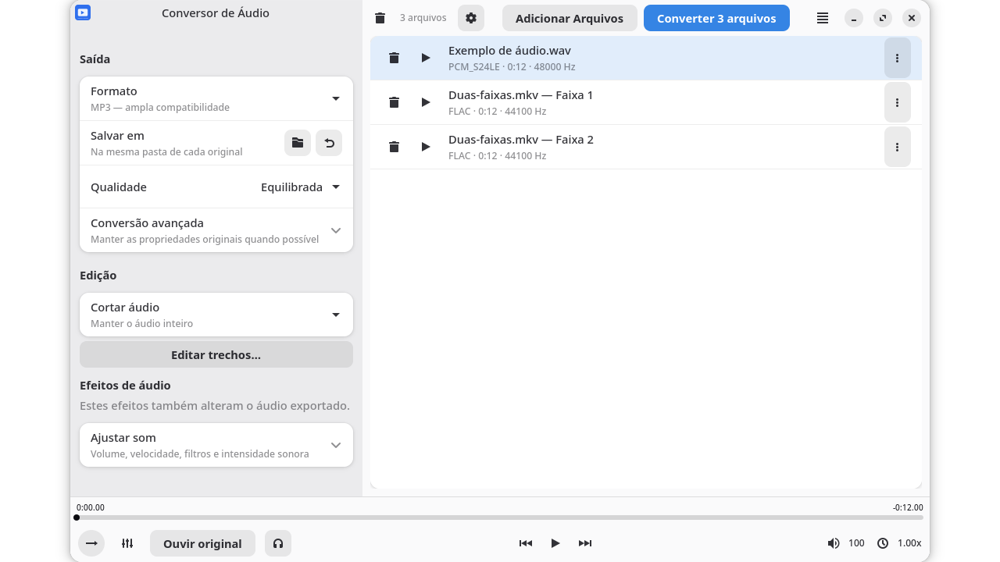

# Big Audio Converter

Convert audio files, extract audio tracks from videos and save selected sections on Linux. The interface uses GTK4 and libadwaita.



## Install and open

On BigLinux, install **Big Audio Converter** from the software manager and open it from the applications menu. The package command is `big-audio-converter-gui`.

Required components: Python 3.10 or newer, GTK 4.12 or newer, libadwaita 1.5 or newer, PyGObject, Pycairo, NumPy, FFmpeg/FFprobe, mpv, python-mpv and [big-gtk-kit](https://github.com/biglinux/big-gtk-kit) (`python-big-gtk-kit`). Speech noise reduction additionally requires one of the optional LADSPA packages listed below; an unavailable mode identifies the package to install.

## Convert files

1. Select **Add Files**, or drag local audio or video files into the window. Videos with multiple audio tracks get a separate entry for each track.
2. Choose **Format** and **Quality**. MP3 is widely compatible. FLAC preserves decoded audio without loss, while WAV stores uncompressed audio. Ogg Vorbis, AAC and Opus are also available.
3. Check **Save to**. By default, each result goes beside its original; you can choose another folder.
4. Select **Convert**. The results show what succeeded, what failed and which files can be retried. Use each result's folder button to find its output.

The inputs stay in the list. Existing files are never overwritten: conflicting output names receive a numeric suffix. Cancel waits for the worker to stop and removes unfinished output. Removing an entry from the list does not delete its source; **Move to Trash** is a separate, confirmed action.

**Advanced encoding** exposes bitrate, channels and sample rate. Original properties are preserved where the selected format supports them. If conversion requires resampling or a precision change, the result identifies it. WAV preserves the source PCM representation; exporting floating-point audio to FLAC requires explicitly allowing 24-bit conversion.

## Cut audio

Select a file and change **Cut audio** from **Keep the whole audio** to the desired ordering. Use **Mark start** and **Mark end** at the current playback position, or open **Edit Segments** to enter times in seconds. The editor supports keyboard navigation, reordering and removal. Its changes take effect when you select **Apply**.

Save each segment separately or merge the marked segments into one file. Files without marked segments are converted in full. The waveform shows peaks from all channels; numeric editing remains available if waveform decoding fails after the duration has been read.

**Copy without changing quality** preserves the encoded audio without applying effects. Cuts follow packet boundaries and are approximate. Container support determines which metadata and artwork survive. Choose an encoding format when you need precise cuts or effects.

## Listen and adjust

The bottom controls play the selected file. **Audio output** lists available playback devices; **System default** uses the default selected by the audio system. Use **Refresh audio outputs** if a newly connected output is missing. If a specifically selected output disappears, playback pauses and returns to the default selection so that resuming is your choice.

Volume, speed, equalizer, normalization and other enabled effects affect both preview and exported audio. **Listen to original** temporarily bypasses processing without changing export settings. Increasing volume or equalizer gain can cause distortion; lower the gain or enable clipping protection.

Speech noise reduction offers exactly two modes:

| Mode | Installation | Plugin |
|---|---|---|
| Light — DeepFilterNet3 | `deepfilternet3-native` | `libdfn3_ladspa.so`, the standard model without LL |
| Higher quality — DPDFNet-2 48 kHz | `dpdfnet-native`, including the W8A16 model | `libdpdfnet_native.so`, label `dpdfnet_native_48hr` |

The light mode is selected initially; noise reduction starts disabled. It is intended for speech, not music. Lower attenuation retains more background sound; 0 dB leaves it unchanged. Both plugins run inference natively in Rust, without ONNX Runtime or OpenVINO. They process each channel at 48 kHz, with the selected output rate restored on export. The converter disables DFN3's microphone startup mute and compensates the plugins' delays (DFN3: 1,919 samples; DPDFNet: 2,880 samples) so the beginning and end are preserved. Use current BigLinux plugin builds; older builds can have different controls or timing.

Install `dpdfnet-native` to get the DPDFNet plugin and its model. Its default model directory is `/usr/share/dpdfnet-native/dpdfnet2_48khz_hr-w8a16`, containing `manifest.json` and `weights.bin`. The plugin supports a `DPDFNET_NATIVE_MODEL` environment override; keep it unset to use the intended DPDFNet-2 model.

The DeepFilterNet package also installs its LL library; the converter never selects it.

Keyboard shortcuts: **Ctrl+O** adds files, **Ctrl+Enter** converts, **Ctrl+Space** plays or pauses, **Ctrl+E** opens the segment editor and **Ctrl+Q** quits.

## Development and validation

From the repository root, run the application with:

```sh
python3 big-audio-converter/usr/share/biglinux/audio-converter/main.py
```

The tests run real FFmpeg and libmpv. They need `pytest` and `hypothesis`; the GTK tests also need Xvfb and a session bus. Point `TMPDIR` at an executable directory if `/tmp` is mounted `noexec`:

```sh
mkdir -p "$HOME/.cache/bac-tests"
TMPDIR="$HOME/.cache/bac-tests" python3 -m pytest -q -m "not extended" tests --ignore=tests/test_gui.py
TMPDIR="$HOME/.cache/bac-tests" xvfb-run -a dbus-run-session -- python3 -m pytest -q tests/test_gui.py
TMPDIR="$HOME/.cache/bac-tests" python3 -m pytest -q -m extended tests
ruff check big-audio-converter/usr/share/biglinux/audio-converter tests
ruff format --check big-audio-converter/usr/share/biglinux/audio-converter tests
```

Conversions write to a staging file that is renamed into place, never over an existing file, only when FFmpeg succeeds; cancelling stops FFmpeg and removes it. Metadata probes and waveform decoding run off the GTK main loop.

The [package recipe](pkgbuild/PKGBUILD) compiles the translations and runs the backend tests; the [CI workflow](.github/workflows/quality.yml) runs the GTK tests too. Audio devices and file-manager actions still need a check on an installed desktop.

## License and support

Licensed under the [GNU General Public License, version 3](LICENSE), GPL-3.0-only.

Report reproducible problems in [GitHub issues](https://github.com/biglinux/big-audio-converter/issues). Include the operation, input/output formats, application version and any error shown. Community support is available in the [BigLinux forum](https://forum.biglinux.com.br/).
